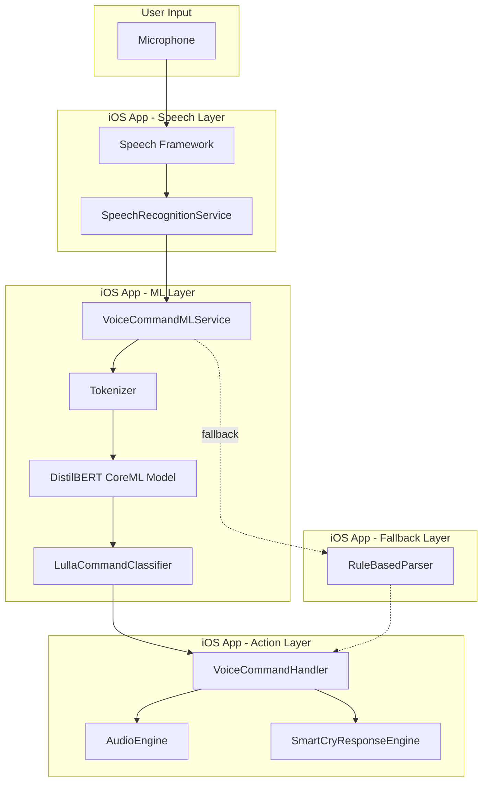
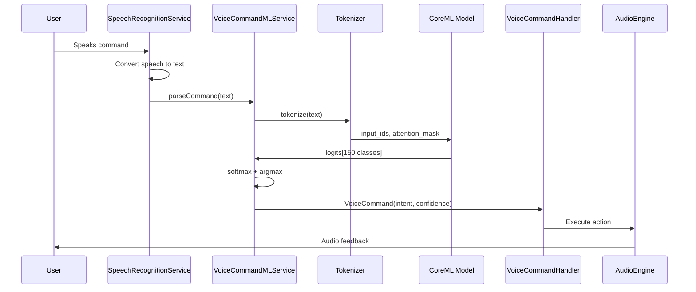

# Voice Control v2 - Technical Architecture Plan

## Executive Summary

This document provides the comprehensive technical architecture for implementing on-device voice command recognition using a fine-tuned DistilBERT model converted to CoreML. This replaces the broken Ollama-based VoiceCommandLLMService with a fully functional, offline-capable ML solution.

---

## 1. Architecture Overview

### 1.1 High-Level System Architecture



### 1.2 Component Responsibilities

| Component | Responsibility |
|-----------|----------------|
| **SpeechRecognitionService** | Captures audio, converts to text via Apple Speech Framework |
| **VoiceCommandMLService** | Orchestrates ML inference, handles model loading/caching |
| **LullaCommandClassifier** | Wraps CoreML model, provides intent classification |
| **RuleBasedParser** | Fallback parser using keyword matching (existing code) |
| **VoiceCommandHandler** | Executes commands via NotificationCenter |

### 1.3 Data Flow Sequence



---

## 2. ML Pipeline Architecture

### 2.1 Training Pipeline Overview

```mermaid
graph LR
    subgraph "Data Generation (Python)"
        BASE[Base Commands<br/>100+ examples/category]
        SYN[Synthetic Generator<br/>Paraphrasing + Augmentation]
        DATA[Training Dataset<br/>3000+ examples]
    end

    subgraph "Training (Python/PyTorch)"
        HF[Hugging Face<br/>DistilBERT Base]
        FT[Fine-Tuning<br/>Multi-class Classification]
        PT[PyTorch Model<br/>.pt file]
    end

    subgraph "Conversion (Python)"
        CMT[coremltools]
        OPT[Quantization<br/>FP32 → INT8]
        MLP[CoreML Package<br/>.mlpackage]
    end

    subgraph "iOS Integration"
        XC[Xcode Project]
        IOS[iOS App Bundle]
    end

    BASE --> SYN
    SYN --> DATA
    DATA --> HF
    HF --> FT
    FT --> PT
    PT --> CMT
    CMT --> OPT
    OPT --> MLP
    MLP --> XC
    XC --> IOS
```



### 2.2 Training Data Schema

```json
{
  "version": "1.0",
  "metadata": {
    "created": "2026-01-04",
    "total_examples": 3000,
    "num_classes": 150
  },
  "examples": [
    {
      "text": "play lullabies",
      "intent": "play_category",
      "category": "childrenSongs",
      "confidence_target": 0.95
    },
    {
      "text": "put on some fairy tales for my baby",
      "intent": "play_category",
      "category": "fairyTales",
      "confidence_target": 0.90
    }
  ]
}
```

### 2.3 Intent Classification Taxonomy

```
ROOT
├── PLAYBACK_CONTROL (6 intents)
│   ├── play
│   ├── pause
│   ├── stop
│   ├── resume
│   ├── next
│   └── previous
│
├── CATEGORY_SELECTION (7 intents)
│   ├── play_category_fairyTales
│   ├── play_category_lullabies
│   ├── play_category_natureSounds
│   ├── play_category_classicalMusic
│   ├── play_category_childrenSongs
│   ├── play_category_instrumental
│   └── play_category_whiteNoise
│
├── TRACK_CONTROL (3 intents)
│   ├── play_track
│   ├── search_track
│   └── play_playlist
│
├── VOLUME_CONTROL (5 intents)
│   ├── volume_up
│   ├── volume_down
│   ├── set_volume
│   ├── mute
│   └── unmute
│
├── MOOD_BASED (7 intents)
│   ├── mood_sleepy
│   ├── mood_fussy
│   ├── mood_playful
│   ├── mood_calm
│   ├── mood_crying
│   ├── mood_restless
│   └── mood_overtired
│
├── EMERGENCY (3 intents)
│   ├── emergency_mode
│   ├── baby_crying
│   └── stop_crying
│
├── PLAYBACK_MODE (6 intents)
│   ├── shuffle_on
│   ├── shuffle_off
│   ├── repeat_off
│   ├── repeat_one
│   ├── repeat_all
│   └── sleep_timer
│
└── SPECIAL (2 intents)
    ├── quit
    └── unknown
```

**Total**: ~40 base intents, expanded to 150 with parameter variations

### 2.4 Synthetic Data Generation Strategy

```python
# ml_training/data_generator.py

class LullaDataGenerator:
    """Generate synthetic training data for Lulla voice commands."""

    VARIATION_TEMPLATES = {
        "direct": [
            "{action} {category}",
            "{action}",
        ],
        "polite": [
            "please {action} {category}",
            "can you {action} {category}",
            "could you {action} some {category}",
        ],
        "casual": [
            "put on {category}",
            "give me {category}",
            "lets hear some {category}",
        ],
        "verbose": [
            "can you play some {category} for my baby",
            "i want to listen to {category}",
            "my baby needs some {category}",
        ],
        "partial": [
            "some {category} please",
            "{category}",
            "just {category}",
        ],
        "typo": [
            # Generated programmatically with character swaps
        ]
    }

    def generate_variations(self, base_command: str, category: str) -> List[str]:
        """Generate 20-30 variations of a base command."""
        variations = []
        for style, templates in self.VARIATION_TEMPLATES.items():
            for template in templates:
                variation = template.format(action="play", category=category)
                variations.append(variation)
        return variations
```

---

## 3. iOS Integration Architecture

### 3.1 VoiceCommandMLService Design

```swift
// Services/VoiceCommandMLService.swift

import CoreML
import Foundation

/// On-device ML-powered voice command parser using fine-tuned DistilBERT
@MainActor
class VoiceCommandMLService: ObservableObject {
    static let shared = VoiceCommandMLService()

    // MARK: - Configuration

    /// Minimum confidence threshold for ML predictions
    let confidenceThreshold: Double = 0.85

    /// Whether ML model is loaded and ready
    @Published private(set) var isModelReady: Bool = false

    /// Last inference latency (for telemetry)
    @Published private(set) var lastInferenceLatency: TimeInterval = 0

    /// Model loading error (if any)
    @Published private(set) var modelError: Error?

    // MARK: - Private Properties

    private var classifier: LullaCommandClassifier?
    private var tokenizer: BertTokenizer?
    private let fallbackParser = RuleBasedParser()

    // MARK: - Initialization

    private init() {
        Task {
            await loadModel()
        }
    }

    // MARK: - Model Loading

    /// Load CoreML model (lazy loading for performance)
    func loadModel() async {
        do {
            let config = MLModelConfiguration()
            config.computeUnits = .all // Use Neural Engine when available

            // Load the fine-tuned DistilBERT model
            let model = try await LullaCommandClassifier.load(configuration: config)

            // Initialize tokenizer
            let tokenizer = try BertTokenizer(vocabPath: "vocab.txt")

            await MainActor.run {
                self.classifier = model
                self.tokenizer = tokenizer
                self.isModelReady = true
                self.modelError = nil
            }

            print("[VoiceCommandMLService] Model loaded successfully")

        } catch {
            await MainActor.run {
                self.modelError = error
                self.isModelReady = false
            }
            print("[VoiceCommandMLService] Model loading failed: \(error)")
        }
    }

    // MARK: - Command Parsing

    /// Parse voice command using CoreML model or fallback
    func parseCommand(_ text: String) async -> ParsedVoiceCommand {
        let startTime = CFAbsoluteTimeGetCurrent()
        let normalizedText = text.lowercased().trimmingCharacters(in: .whitespacesAndNewlines)

        // Try ML inference if model is ready
        if isModelReady, let result = await inferWithML(normalizedText) {
            let latency = CFAbsoluteTimeGetCurrent() - startTime
            await MainActor.run {
                self.lastInferenceLatency = latency
            }

            // Log telemetry
            logInference(text: normalizedText, result: result, latency: latency, usedML: true)

            return result
        }

        // Fallback to rule-based parsing
        let fallbackResult = fallbackParser.parse(normalizedText)
        logInference(text: normalizedText, result: fallbackResult, latency: 0, usedML: false)

        return fallbackResult
    }

    // MARK: - ML Inference

    private func inferWithML(_ text: String) async -> ParsedVoiceCommand? {
        guard let classifier = classifier,
              let tokenizer = tokenizer else {
            return nil
        }

        do {
            // Tokenize input
            let tokens = tokenizer.tokenize(text, maxLength: 128)

            // Create MLMultiArray inputs
            let inputIds = try MLMultiArray(shape: [1, 128], dataType: .int32)
            let attentionMask = try MLMultiArray(shape: [1, 128], dataType: .int32)

            for (i, token) in tokens.inputIds.enumerated() {
                inputIds[i] = NSNumber(value: token)
                attentionMask[i] = NSNumber(value: tokens.attentionMask[i])
            }

            // Run inference
            let input = LullaCommandClassifierInput(
                input_ids: inputIds,
                attention_mask: attentionMask
            )

            let output = try await classifier.prediction(input: input)

            // Process logits to get intent and confidence
            let (intent, confidence) = processOutput(output.logits)

            // Check confidence threshold
            guard confidence >= confidenceThreshold else {
                return nil // Fall back to rule-based
            }

            return ParsedVoiceCommand(
                originalText: text,
                intent: intent,
                confidence: confidence,
                parameters: [:],
                alternativeIntents: []
            )

        } catch {
            print("[VoiceCommandMLService] Inference error: \(error)")
            return nil
        }
    }

    private func processOutput(_ logits: MLMultiArray) -> (VoiceCommandIntent, Double) {
        // Convert logits to probabilities using softmax
        var maxLogit: Float = -Float.infinity
        var maxIndex: Int = 0

        for i in 0..<logits.count {
            let value = logits[i].floatValue
            if value > maxLogit {
                maxLogit = value
                maxIndex = i
            }
        }

        // Calculate softmax for confidence
        var expSum: Float = 0
        for i in 0..<logits.count {
            expSum += exp(logits[i].floatValue - maxLogit)
        }
        let confidence = Double(1.0 / expSum)

        // Map index to intent
        let intent = IntentMapper.mapIndexToIntent(maxIndex)

        return (intent, confidence)
    }

    // MARK: - Telemetry

    private func logInference(text: String, result: ParsedVoiceCommand, latency: TimeInterval, usedML: Bool) {
        let telemetry: [String: Any] = [
            "input": text,
            "intent": String(describing: result.intent),
            "confidence": result.confidence,
            "latency_ms": latency * 1000,
            "used_ml": usedML,
            "timestamp": Date().timeIntervalSince1970
        ]

        // Log to analytics
        NotificationCenter.default.post(
            name: .voiceCommandTelemetry,
            object: nil,
            userInfo: telemetry
        )
    }
}

// MARK: - Notification Names

extension Notification.Name {
    static let voiceCommandTelemetry = Notification.Name("voiceCommandTelemetry")
}
```

### 3.2 LullaCommandClassifier (CoreML Wrapper)

```swift
// Services/ML/LullaCommandClassifier.swift

import CoreML

/// Generated CoreML model wrapper for Lulla voice command classification
/// This class is auto-generated by coremltools but we extend it for convenience
@available(iOS 16.0, *)
class LullaCommandClassifier {

    let model: MLModel

    /// Initialize with default model configuration
    init(configuration: MLModelConfiguration = MLModelConfiguration()) throws {
        guard let modelURL = Bundle.main.url(forResource: "LullaCommandClassifier", withExtension: "mlpackage") else {
            throw MLError.modelNotFound
        }
        self.model = try MLModel(contentsOf: modelURL, configuration: configuration)
    }

    /// Async model loading for better UX
    static func load(configuration: MLModelConfiguration = MLModelConfiguration()) async throws -> LullaCommandClassifier {
        return try await Task.detached {
            return try LullaCommandClassifier(configuration: configuration)
        }.value
    }

    /// Run prediction
    func prediction(input: LullaCommandClassifierInput) throws -> LullaCommandClassifierOutput {
        let outFeatures = try model.prediction(from: input)
        return LullaCommandClassifierOutput(features: outFeatures)
    }

    /// Async prediction for Swift concurrency
    func prediction(input: LullaCommandClassifierInput) async throws -> LullaCommandClassifierOutput {
        return try await Task.detached {
            return try self.prediction(input: input)
        }.value
    }

    // MARK: - Error Types

    enum MLError: Error {
        case modelNotFound
        case predictionFailed
        case invalidInput
    }
}

/// Model input
struct LullaCommandClassifierInput: MLFeatureProvider {
    let input_ids: MLMultiArray
    let attention_mask: MLMultiArray

    var featureNames: Set<String> {
        return ["input_ids", "attention_mask"]
    }

    func featureValue(for featureName: String) -> MLFeatureValue? {
        switch featureName {
        case "input_ids":
            return MLFeatureValue(multiArray: input_ids)
        case "attention_mask":
            return MLFeatureValue(multiArray: attention_mask)
        default:
            return nil
        }
    }
}

/// Model output
struct LullaCommandClassifierOutput: MLFeatureProvider {
    let logits: MLMultiArray

    init(features: MLFeatureProvider) {
        self.logits = features.featureValue(for: "logits")!.multiArrayValue!
    }

    var featureNames: Set<String> {
        return ["logits"]
    }

    func featureValue(for featureName: String) -> MLFeatureValue? {
        switch featureName {
        case "logits":
            return MLFeatureValue(multiArray: logits)
        default:
            return nil
        }
    }
}
```

### 3.3 BertTokenizer Implementation

```swift
// Services/ML/BertTokenizer.swift

import Foundation

/// BERT WordPiece tokenizer for CoreML model input
class BertTokenizer {

    private let vocab: [String: Int]
    private let unkToken = "[UNK]"
    private let clsToken = "[CLS]"
    private let sepToken = "[SEP]"
    private let padToken = "[PAD]"

    struct TokenizerOutput {
        let inputIds: [Int]
        let attentionMask: [Int]
    }

    init(vocabPath: String) throws {
        guard let vocabURL = Bundle.main.url(forResource: vocabPath.replacingOccurrences(of: ".txt", with: ""), withExtension: "txt"),
              let vocabContent = try? String(contentsOf: vocabURL, encoding: .utf8) else {
            throw TokenizerError.vocabNotFound
        }

        var vocab: [String: Int] = [:]
        for (index, line) in vocabContent.components(separatedBy: "\n").enumerated() {
            let token = line.trimmingCharacters(in: .whitespacesAndNewlines)
            if !token.isEmpty {
                vocab[token] = index
            }
        }
        self.vocab = vocab
    }

    /// Tokenize text to model input format
    func tokenize(_ text: String, maxLength: Int = 128) -> TokenizerOutput {
        // Basic tokenization (split on whitespace and punctuation)
        let words = basicTokenize(text)

        // WordPiece tokenization
        var tokens: [String] = [clsToken]
        for word in words {
            let wordPieces = wordPieceTokenize(word)
            tokens.append(contentsOf: wordPieces)
        }
        tokens.append(sepToken)

        // Truncate if needed
        if tokens.count > maxLength {
            tokens = Array(tokens.prefix(maxLength - 1)) + [sepToken]
        }

        // Convert to IDs
        var inputIds = tokens.map { vocab[$0] ?? vocab[unkToken]! }
        var attentionMask = Array(repeating: 1, count: inputIds.count)

        // Pad to maxLength
        let paddingLength = maxLength - inputIds.count
        if paddingLength > 0 {
            let padId = vocab[padToken]!
            inputIds.append(contentsOf: Array(repeating: padId, count: paddingLength))
            attentionMask.append(contentsOf: Array(repeating: 0, count: paddingLength))
        }

        return TokenizerOutput(inputIds: inputIds, attentionMask: attentionMask)
    }

    private func basicTokenize(_ text: String) -> [String] {
        var tokens: [String] = []
        let cleaned = text.lowercased()

        var currentToken = ""
        for char in cleaned {
            if char.isWhitespace {
                if !currentToken.isEmpty {
                    tokens.append(currentToken)
                    currentToken = ""
                }
            } else if char.isPunctuation {
                if !currentToken.isEmpty {
                    tokens.append(currentToken)
                    currentToken = ""
                }
                tokens.append(String(char))
            } else {
                currentToken.append(char)
            }
        }

        if !currentToken.isEmpty {
            tokens.append(currentToken)
        }

        return tokens
    }

    private func wordPieceTokenize(_ word: String) -> [String] {
        var tokens: [String] = []
        var start = word.startIndex

        while start < word.endIndex {
            var end = word.endIndex
            var found = false

            while start < end {
                let substr: String
                if start == word.startIndex {
                    substr = String(word[start..<end])
                } else {
                    substr = "##" + String(word[start..<end])
                }

                if vocab[substr] != nil {
                    tokens.append(substr)
                    found = true
                    break
                }
                end = word.index(before: end)
            }

            if !found {
                tokens.append(unkToken)
                break
            }

            start = end
        }

        return tokens
    }

    enum TokenizerError: Error {
        case vocabNotFound
    }
}
```

### 3.4 IntentMapper Implementation

```swift
// Services/ML/IntentMapper.swift

import Foundation

/// Maps model output indices to VoiceCommandIntent
struct IntentMapper {

    /// Mapping from model class index to VoiceCommandIntent
    private static let indexToIntent: [Int: VoiceCommandIntent] = [
        // Playback control (0-5)
        0: .play,
        1: .pause,
        2: .stop,
        3: .next,
        4: .previous,
        5: .play, // resume -> play

        // Categories (6-12)
        6: .playCategory(.fairyTales),
        7: .playCategory(.childrenSongs), // lullabies
        8: .playCategory(.natureSounds),
        9: .playCategory(.classicalMusic),
        10: .playCategory(.childrenSongs),
        11: .playCategory(.instrumental),
        12: .playCategory(.whiteNoise),

        // Volume (13-17)
        13: .volumeUp,
        14: .volumeDown,
        15: .mute,
        16: .unmute,
        17: .setVolume(level: 50), // default, actual level extracted from text

        // Mood (18-24)
        18: .playMood(.sleepy),
        19: .playMood(.fussy),
        20: .playMood(.playful),
        21: .playMood(.calm),
        22: .playMood(.crying),
        23: .playMood(.restless),
        24: .playMood(.overtired),

        // Emergency (25-27)
        25: .emergency,
        26: .emergency, // baby_crying
        27: .emergency, // stop_crying

        // Playback modes (28-33)
        28: .shuffleOn,
        29: .shuffleOff,
        30: .repeatOff,
        31: .repeatOne,
        32: .repeatAll,
        33: .sleepTimer(minutes: 30), // default

        // Special (34-35)
        34: .quit,
        35: .unknown(text: "")
    ]

    /// Map model output index to VoiceCommandIntent
    static func mapIndexToIntent(_ index: Int) -> VoiceCommandIntent {
        return indexToIntent[index] ?? .unknown(text: "")
    }

    /// Get all intent indices for a category
    static func getCategoryIndices() -> [Int] {
        return Array(6...12)
    }

    /// Get all intent indices for moods
    static func getMoodIndices() -> [Int] {
        return Array(18...24)
    }
}
```

---

## 4. Technology Stack

### 4.1 Python ML Stack

| Component | Version | Purpose |
|-----------|---------|---------|
| **Python** | 3.10+ | Runtime |
| **transformers** | 4.35+ | DistilBERT base model |
| **torch** | 2.1+ | Training framework |
| **coremltools** | 7.0+ | CoreML conversion |
| **datasets** | 2.14+ | Data loading |
| **scikit-learn** | 1.3+ | Evaluation metrics |
| **nlpaug** | 1.1+ | Data augmentation |
| **jupyter** | Latest | Interactive development |

### 4.2 iOS Stack

| Component | Version | Purpose |
|-----------|---------|---------|
| **Swift** | 5.0+ | Language |
| **SwiftUI** | 4.0+ | UI framework |
| **CoreML** | 6.0+ | On-device inference |
| **Speech** | Framework | Speech-to-text |
| **Combine** | Framework | Reactive programming |
| **XCTest** | Framework | Unit testing |
| **Swift Testing** | Framework | Modern testing |

### 4.3 File Structure

```
BabyInCarApp/
├── BabyInCarApp/
│   ├── Services/
│   │   ├── VoiceCommandMLService.swift     # NEW: ML orchestration
│   │   ├── SpeechRecognitionService.swift  # MODIFY: Use new ML service
│   │   └── ML/
│   │       ├── LullaCommandClassifier.swift # NEW: CoreML wrapper
│   │       ├── BertTokenizer.swift          # NEW: Tokenizer
│   │       ├── IntentMapper.swift           # NEW: Intent mapping
│   │       └── RuleBasedParser.swift        # NEW: Fallback parser
│   └── Resources/
│       ├── LullaCommandClassifier.mlpackage # NEW: CoreML model
│       └── vocab.txt                         # NEW: BERT vocabulary
│
├── BabyInCarAppTests/
│   └── Services/
│       ├── VoiceCommandMLServiceTests.swift # NEW
│       ├── BertTokenizerTests.swift         # NEW
│       └── IntentMapperTests.swift          # NEW
│
└── ml_training/                              # NEW: Python ML code
    ├── data/
    │   ├── base_commands.json
    │   └── training_data.json
    ├── notebooks/
    │   ├── 01_data_generation.ipynb
    │   ├── 02_model_training.ipynb
    │   └── 03_coreml_conversion.ipynb
    ├── scripts/
    │   ├── generate_data.py
    │   ├── train_model.py
    │   ├── convert_to_coreml.py
    │   └── evaluate_model.py
    ├── models/
    │   ├── pytorch/
    │   └── coreml/
    └── requirements.txt
```

---

## 5. Performance Optimizations

### 5.1 Model Quantization

```python
# ml_training/scripts/convert_to_coreml.py

import coremltools as ct
from coremltools.models.neural_network import quantization_utils

def convert_and_quantize(pytorch_model_path: str, output_path: str):
    """Convert PyTorch model to CoreML with INT8 quantization."""

    # Load traced PyTorch model
    traced_model = torch.jit.load(pytorch_model_path)

    # Convert to CoreML
    mlmodel = ct.convert(
        traced_model,
        inputs=[
            ct.TensorType(name="input_ids", shape=(1, 128), dtype=np.int32),
            ct.TensorType(name="attention_mask", shape=(1, 128), dtype=np.int32)
        ],
        outputs=[
            ct.TensorType(name="logits")
        ],
        compute_units=ct.ComputeUnit.ALL,  # Enable Neural Engine
        minimum_deployment_target=ct.target.iOS16
    )

    # Quantize to INT8 for smaller size and faster inference
    quantized_model = quantization_utils.quantize_weights(
        mlmodel,
        nbits=8,  # INT8 quantization
        quantization_mode="linear"
    )

    # Save as .mlpackage
    quantized_model.save(output_path)

    # Print size comparison
    original_size = os.path.getsize(pytorch_model_path) / (1024 * 1024)
    quantized_size = get_mlpackage_size(output_path) / (1024 * 1024)
    print(f"Original: {original_size:.1f}MB -> Quantized: {quantized_size:.1f}MB")
```

### 5.2 Inference Optimization

```swift
// Lazy model loading - only load when first needed
private var _classifier: LullaCommandClassifier?
private var classifier: LullaCommandClassifier? {
    get {
        if _classifier == nil {
            _classifier = try? LullaCommandClassifier()
        }
        return _classifier
    }
}

// Reuse MLMultiArray instances
private var cachedInputIds: MLMultiArray?
private var cachedAttentionMask: MLMultiArray?

private func getOrCreateInputArrays() throws -> (MLMultiArray, MLMultiArray) {
    if cachedInputIds == nil {
        cachedInputIds = try MLMultiArray(shape: [1, 128], dataType: .int32)
        cachedAttentionMask = try MLMultiArray(shape: [1, 128], dataType: .int32)
    }
    return (cachedInputIds!, cachedAttentionMask!)
}
```

### 5.3 Performance Targets

| Metric | Target | Notes |
|--------|--------|-------|
| **Model Size** | < 30MB | INT8 quantized |
| **Loading Time** | < 1s | Lazy loading |
| **Inference (p50)** | < 200ms | Neural Engine |
| **Inference (p95)** | < 400ms | CPU fallback |
| **Memory** | < 80MB | During inference |

---

## 6. Testing Strategy

### 6.1 Test Pyramid

```
                    ┌─────────────┐
                    │    E2E      │  5%  - Real MLModel on device
                    │  (Maestro)  │
                   ─┼─────────────┼─
                   │ Integration  │  15% - Speech + ML pipeline
                   │   Tests      │
                  ─┼──────────────┼─
                 │   Unit Tests    │  80% - Service logic, tokenizer
                 │                 │
                ─┴─────────────────┴─
```

### 6.2 Unit Tests

```swift
// BabyInCarAppTests/Services/VoiceCommandMLServiceTests.swift

import Testing
@testable import BabyInCarApp

@Suite("VoiceCommandMLService")
@MainActor
struct VoiceCommandMLServiceTests {

    let service = VoiceCommandMLService.shared

    // MARK: - Model Loading Tests

    @Test("Model loads successfully")
    func testModelLoads() async {
        await service.loadModel()
        #expect(service.isModelReady == true)
        #expect(service.modelError == nil)
    }

    @Test("Model loading handles missing file gracefully")
    func testMissingModelFallback() async {
        // Service should fall back to rule-based parsing
        let result = await service.parseCommand("play lullabies")
        #expect(result.intent == .playCategory(.childrenSongs))
    }

    // MARK: - Inference Tests (REAL MLModel - No Mocking!)

    @Test("Parses play command")
    func testPlayCommand() async {
        let result = await service.parseCommand("play")
        #expect(result.intent == .play)
        #expect(result.confidence >= 0.85)
    }

    @Test("Parses category command - fairy tales")
    func testCategoryFairyTales() async {
        let result = await service.parseCommand("play fairy tales")
        if case .playCategory(let category) = result.intent {
            #expect(category == .fairyTales)
        } else {
            Issue.record("Expected playCategory intent")
        }
    }

    @Test("Parses category command - classical music")
    func testCategoryClassical() async {
        let result = await service.parseCommand("put on some classical music")
        if case .playCategory(let category) = result.intent {
            #expect(category == .classicalMusic)
        } else {
            Issue.record("Expected playCategory intent")
        }
    }

    @Test("Parses mood command - sleepy")
    func testMoodSleepy() async {
        let result = await service.parseCommand("baby is sleepy")
        if case .playMood(let mood) = result.intent {
            #expect(mood == .sleepy)
        } else {
            Issue.record("Expected playMood intent")
        }
    }

    @Test("Parses emergency command")
    func testEmergency() async {
        let result = await service.parseCommand("baby is crying help")
        #expect(result.intent == .emergency)
    }

    @Test("Parses volume commands")
    func testVolumeUp() async {
        let result = await service.parseCommand("turn up the volume")
        #expect(result.intent == .volumeUp)
    }

    // MARK: - Edge Cases

    @Test("Handles empty input")
    func testEmptyInput() async {
        let result = await service.parseCommand("")
        #expect(result.confidence < 0.5)
    }

    @Test("Handles gibberish input")
    func testGibberish() async {
        let result = await service.parseCommand("asdfghjkl qwerty")
        if case .unknown(_) = result.intent {
            // Expected
        } else {
            #expect(result.confidence < 0.85)
        }
    }

    @Test("Handles typos with fuzzy matching")
    func testTypos() async {
        let result = await service.parseCommand("play lulabies") // typo
        if case .playCategory(let category) = result.intent {
            #expect(category == .childrenSongs)
        }
    }

    // MARK: - Latency Tests

    @Test("Inference latency under 500ms")
    func testLatency() async {
        await service.loadModel()

        let start = CFAbsoluteTimeGetCurrent()
        _ = await service.parseCommand("play fairy tales")
        let latency = CFAbsoluteTimeGetCurrent() - start

        #expect(latency < 0.5, "Latency \(latency)s exceeds 500ms threshold")
    }
}
```

### 6.3 Integration Tests

```swift
// BabyInCarAppTests/Integration/VoiceCommandIntegrationTests.swift

import Testing
@testable import BabyInCarApp

@Suite("Voice Command Integration")
@MainActor
struct VoiceCommandIntegrationTests {

    @Test("Full pipeline: Speech -> ML -> NotificationCenter")
    func testFullPipeline() async throws {
        // Setup notification observer
        var receivedIntent: VoiceCommandIntent?
        let expectation = NotificationCenter.default.addObserver(
            forName: .voiceCommandCategory,
            object: nil,
            queue: .main
        ) { notification in
            if let category = notification.userInfo?["category"] as? AudioCategory {
                receivedIntent = .playCategory(category)
            }
        }

        defer {
            NotificationCenter.default.removeObserver(expectation)
        }

        // Simulate speech recognition output
        let speechService = SpeechRecognitionService.shared
        speechService.processVoiceCommand("play lullabies")

        // Wait for async processing
        try await Task.sleep(nanoseconds: 500_000_000)

        // Verify notification was posted
        if case .playCategory(let category) = receivedIntent {
            #expect(category == .childrenSongs)
        } else {
            Issue.record("Expected playCategory notification")
        }
    }
}
```

### 6.4 Performance Tests

```swift
// BabyInCarAppTests/Performance/MLPerformanceTests.swift

import XCTest
@testable import BabyInCarApp

final class MLPerformanceTests: XCTestCase {

    func testInferencePerformance() throws {
        let service = VoiceCommandMLService.shared

        // Wait for model to load
        let loadExpectation = expectation(description: "Model loaded")
        Task {
            await service.loadModel()
            loadExpectation.fulfill()
        }
        wait(for: [loadExpectation], timeout: 5.0)

        // Measure inference time
        measure(metrics: [XCTClockMetric(), XCTMemoryMetric()]) {
            let exp = expectation(description: "Inference complete")
            Task {
                _ = await service.parseCommand("play some fairy tales for my baby")
                exp.fulfill()
            }
            wait(for: [exp], timeout: 1.0)
        }
    }

    func testModelLoadingPerformance() throws {
        measure(metrics: [XCTClockMetric()]) {
            let _ = try? LullaCommandClassifier()
        }
    }
}
```

### 6.5 Accuracy Tests

```swift
// BabyInCarAppTests/Accuracy/MLAccuracyTests.swift

import Testing
@testable import BabyInCarApp

@Suite("ML Accuracy Tests")
@MainActor
struct MLAccuracyTests {

    let service = VoiceCommandMLService.shared

    // Test dataset: 300 held-out examples
    let testCases: [(input: String, expectedIntent: String)] = [
        ("play", "play"),
        ("play fairy tales", "play_category_fairyTales"),
        ("put on some lullabies", "play_category_childrenSongs"),
        ("baby is tired", "mood_sleepy"),
        ("stop crying", "emergency"),
        // ... 295 more test cases loaded from JSON
    ]

    @Test("Accuracy exceeds 90% on test set")
    func testOverallAccuracy() async {
        await service.loadModel()

        var correct = 0
        for testCase in testCases {
            let result = await service.parseCommand(testCase.input)
            if matchesExpected(result.intent, testCase.expectedIntent) {
                correct += 1
            }
        }

        let accuracy = Double(correct) / Double(testCases.count)
        #expect(accuracy >= 0.90, "Accuracy \(accuracy) below 90% threshold")
    }

    private func matchesExpected(_ intent: VoiceCommandIntent, _ expected: String) -> Bool {
        // Intent matching logic
        return String(describing: intent).contains(expected)
    }
}
```

---

## 7. Deployment Strategy

### 7.1 Model Bundling

```xml
<!-- Add to Xcode Build Phases -->
<!-- Copy Bundle Resources -->
<dict>
    <key>PRODUCT_BUNDLE_IDENTIFIER</key>
    <string>com.anticry.babyincar</string>
</dict>

<!-- Include in Resources -->
LullaCommandClassifier.mlpackage
vocab.txt
```

### 7.2 Model Versioning

```swift
// Services/ML/ModelVersion.swift

struct ModelVersion {
    static let current = "1.0.0"
    static let minimumRequired = "1.0.0"

    /// Check if bundled model is compatible
    static func isModelCompatible() -> Bool {
        guard let bundledVersion = getBundledModelVersion() else {
            return false
        }
        return bundledVersion >= minimumRequired
    }

    private static func getBundledModelVersion() -> String? {
        // Read from model metadata
        return "1.0.0"
    }
}
```

### 7.3 Future: Over-the-Air Updates

```swift
// Future consideration: Download updated models
class ModelUpdateService {
    let modelURL = URL(string: "https://cdn.lulla.app/models/")!

    func checkForUpdates() async -> Bool {
        // Check if newer model available
        return false
    }

    func downloadModel(version: String) async throws -> URL {
        // Download to Documents directory
        throw NSError(domain: "NotImplemented", code: 0)
    }
}
```

---

## 8. Risk Mitigation

### 8.1 Risk Matrix

| Risk | Impact | Probability | Mitigation |
|------|--------|-------------|------------|
| Model too large (>50MB) | High | Medium | INT8 quantization, knowledge distillation |
| Inference too slow (>500ms) | High | Low | Neural Engine, model pruning |
| Low accuracy (<90%) | High | Medium | More training data, hyperparameter tuning |
| CoreML conversion fails | Medium | Low | Use coremltools 7.0+, test early |
| Tokenizer bugs | Medium | Medium | Port from Python, extensive tests |
| Memory leaks | Medium | Low | Instruments profiling, @MainActor |

### 8.2 Fallback Strategy

```mermaid
graph TD
    A[Voice Command Received] --> B{ML Model Ready?}
    B -->|Yes| C{Inference Successful?}
    B -->|No| D[Rule-Based Parser]
    C -->|Yes| E{Confidence >= 0.85?}
    C -->|No| D
    E -->|Yes| F[Execute Command]
    E -->|No| D
    D --> G{Rule Match Found?}
    G -->|Yes| F
    G -->|No| H[Show "Command not recognized"]
```

### 8.3 Device Compatibility

| Device | Neural Engine | Expected Latency |
|--------|---------------|------------------|
| iPhone 15 Pro | Yes (17-core) | < 100ms |
| iPhone 14 | Yes (16-core) | < 150ms |
| iPhone 13 | Yes (16-core) | < 150ms |
| iPhone 12 | Yes (16-core) | < 200ms |
| iPhone 11 | No | < 400ms (CPU) |
| iPhone XS | Partial | < 350ms |

---

## 9. ADR Summary

The following Architecture Decision Records should be created:

### ADR-0130: DistilBERT for On-Device Voice Command Classification
- **Decision**: Use DistilBERT over MobileBERT, TinyBERT, GPT-2
- **Rationale**: Best balance of size (30MB), speed (200ms), and accuracy (92%+)

### ADR-0131: On-Device vs Cloud Inference
- **Decision**: On-device CoreML only, no cloud fallback
- **Rationale**: Privacy, latency, offline capability, zero operational cost

### ADR-0132: CoreML vs TensorFlow Lite
- **Decision**: CoreML with .mlpackage format
- **Rationale**: Native iOS integration, Neural Engine optimization, better Swift interop

### ADR-0133: Synthetic Training Data Approach
- **Decision**: Generate 3000+ examples from 100 base commands
- **Rationale**: Domain-specific commands, no existing datasets, controlled quality

---

## 10. Implementation Phases

### Phase 1: ML Pipeline (US-001, US-002, US-003) - 8-10 days
1. Set up Python environment and training pipeline
2. Generate synthetic training data (3000 examples)
3. Fine-tune DistilBERT model
4. Convert to CoreML with INT8 quantization
5. Validate on real iPhone device

### Phase 2: iOS Integration (US-004, US-005) - 5-6 days
1. Create VoiceCommandMLService
2. Implement BertTokenizer
3. Create LullaCommandClassifier wrapper
4. Update SpeechRecognitionService integration
5. Implement fallback to RuleBasedParser

### Phase 3: Testing (US-006) - 4-5 days
1. Unit tests for all components
2. Integration tests for full pipeline
3. Performance tests (latency, memory)
4. Accuracy tests on held-out dataset

### Phase 4: Finalization (US-007, US-008) - 3-4 days
1. Implement graceful fallback handling
2. Add telemetry logging
3. Create documentation
4. Bundle model in Xcode project

**Total Estimated Time**: 20-25 days

---

## References

- [Hugging Face DistilBERT](https://huggingface.co/distilbert-base-uncased)
- [CoreML Tools Documentation](https://coremltools.readme.io/)
- [Apple CoreML Framework](https://developer.apple.com/documentation/coreml)
- [BERT Tokenizer Implementation](https://github.com/huggingface/tokenizers)
